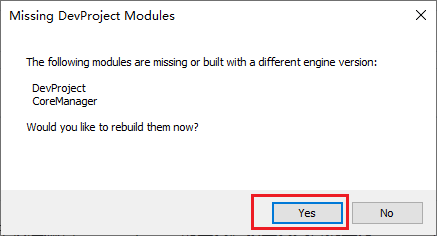
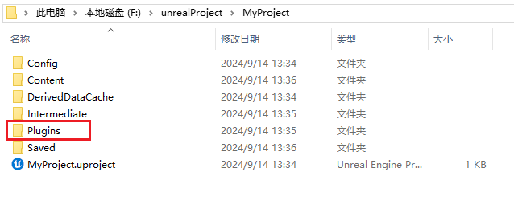
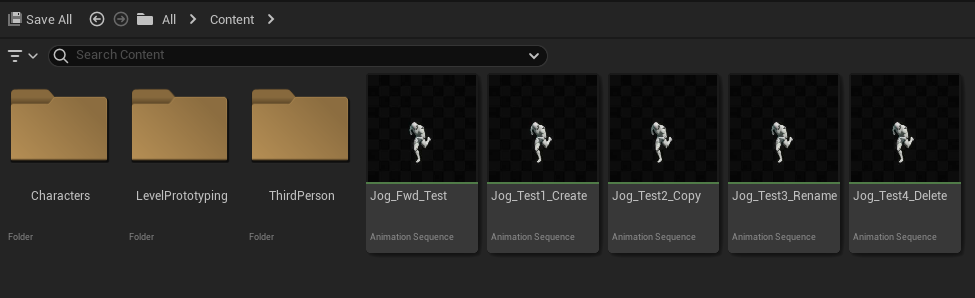

# Animation Curve Modifier
Animation Curve Modifier是一个用于在UE中快速编辑AnimSequence的工具。该工具支持批量为AnimSequence新增、复制、重命名和删除动画曲线。
<h2 id="wDfV9">使用演示</h2>

+ [视频链接](https://youtu.be/0l16tB7kUg4?si=bf6Aj0nZ1PGrOSLc)

+ MP4文件：[AnimCurveModifier使用演示.mp4](https://github.com/Clairezsh/AnimCurveModifier/blob/main/AnimCurveModifier%E4%BD%BF%E7%94%A8%E6%BC%94%E7%A4%BA.mp4)

<h2 id="wDfV9">开发环境</h2>

+ 编程语言：C++，
+ 界面：Slate，
+ 引擎版本：UE 5.2

目前暂时**只支持 UE 5.2**，还未作其它版本的 API 适配。

<h2 id="WjGRD">文件结构</h2>

工具的源码位于 [Plugins / CoreManager](https://github.com/Clairezsh/AnimCurveModifier/tree/main/Plugins/CoreManager) 下。

+ [CoreManager.cpp](https://github.com/Clairezsh/AnimCurveModifier/blob/main/Plugins/CoreManager/Source/CoreManager/Private/CoreManager.cpp) - 插件调用的入口文件，用于加载插件，创建菜单栏选项和下拉按钮，打开工具窗口；
+ [CoreManagerCommand.cpp](https://github.com/Clairezsh/AnimCurveModifier/blob/main/Plugins/CoreManager/Source/CoreManager/Private/CoreManagerCommand.cpp) - 定义和注册打开窗口的 UI_Command，用于给菜单栏按钮绑定命令；
+ [SAnimCurveModifierWidget.cpp](https://github.com/Clairezsh/AnimCurveModifier/blob/main/Plugins/CoreManager/Source/CoreManager/Private/SAnimCurveModifierWidget.cpp) - 窗口的 Slate 代码文件，以及按钮的基础功能；
+ [AnimCurveModifierFunctions.cpp](https://github.com/Clairezsh/AnimCurveModifier/blob/main/Plugins/CoreManager/Source/CoreManager/Private/AnimCurveModifierFunctions.cpp) - 处理 AnimSequence 的**核心函数**，包含新增、复制、重命名和删除 AnimSequence 中动画曲线的功能实现。

<h2 id="Hv9Vr">注意事项</h2>

+ 请将输入法设置成英文后，再在文本框中进行输入。
+ 若使用过程中工具异常，请重启工具后再进行尝试。
+ 若操作完之后动画数据未更新，可以关闭和重新打开动画序列来刷新更改。

<h2 id="MmHz1">如何使用</h2>

+ 两种方法加载插件：

  方法1：直接将整个 UE 工程下载到本地，用 UE 5.2 打开 DevProject.uproject。中途会出现以下提示，点 Yes 即可，然后稍等片刻。

  

  方法2：将 DevProject / Plugins 文件夹复制到自己工程目录下，重启 UE。

  

+ 加载插件后，可通过最上方菜单栏 **“CustomUtils -> Animation Curve Modifier”** 来打开工具窗口。

+ 提供了4个动画序列供测试使用。

